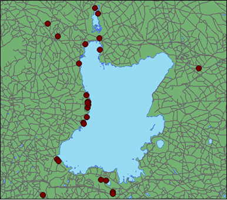
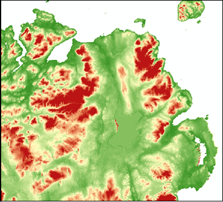

```{r setup, include=FALSE}
knitr::opts_chunk$set(echo = TRUE)
```


##  TCD R-users group notes and code 

### Introduction to mapping in R 

####  Notes and code by Ruth Kelly with 09/10/2018 

The aim of this code file is to introduce you to some of the basic file types, formats and packages for working with spatial data in R.  

It is by no means comprehensive and there are many many more packages out there, but hopefully this will help to get started and understand the structure of spatial data files both in R and elsewhere. 


### The two main types of map files 

1. Shape/vector files (.shp etc)
    + Points  
    + Lines  
    + Polygons  
Representations of categorical data and objects.  





2. Raster files (.ra, .asc)
    + Pixel images 

For continous data, best for map algebra and modelling.  



    
#### Part 1. Shape/vector files


```{r libraries for shapefiles, include = FALSE, echo = TRUE}
library("maptools")
library("rgdal")
library("sp")
library('GISTools')
library('RColorBrewer')
library('raster')
```


Fundamentally, in my mind at least, geospatial modelling is all about the relationships between objects based on their locations. So the most importnat thing in any spatial dataset is knowing where objects are located in space (and therefore relative to one another). 

To illustrate this let's load in some data from a standard spreadsheet format, and turn it into map/spatial data using the function 'coordinates' in the package 'sp'

####  Loading in your own field data, from spreadsheet format. 

```{r Creating spatial data from a spreadsheet format}

### read in your data file as from .csv or text file as usual. 
## e.g.

all_sites_year1 <- read.csv("all_sites_year2.csv")

### view this to see if it has loaded properly
summary(all_sites_year1)
head(all_sites_year1)

class(all_sites_year1)

### Turn this into a SpatialPointsDataFrame,
## using the function ' coordinates'in the package 'sp'
## You do this by 'telling' R which columns in the dataframe contain the 
## coordinate locations. 

### The objects after the <- are the names of the columns containing the 
### coordinate data in the dataframe.  
### Don't forget the ~ symbol after the  <- 

coordinates(all_sites_year1) <- ~ x_coordina + y_coordina
class(all_sites_year1)

## all_sites_year1 is now a spatial file, class = sp

### Note that when we plot this R automatically plots the coordinate columns. 
plot(all_sites_year1, pch = 1)


```

The other common format in which you will recieve vector/shape files is as esri shapefiles. These are not a single file, but a collection of files representing different aspects of the map. Have a look in the file folder here to see all the files associated with a single map showing the counties of Northern Ireland (ni_counties.shp etc.)

The functions 'readOGR' and 'writeOGR' let you read and write Esri shapefiles for compatibility ArcView (in package 'rgdal')

Files in this format can be read in with the following code chunk


```{r Loading esri shape files}


counties <- readOGR(dsn = ".", layer = "ni_counties")

#### plot these

plot(counties)

plot(all_sites_year1, col = all_sites_year1$Burnt, pch = 16, add = T)

```

A vector or shapefile is a complex object with various components the most important of which are
  + the data
  + the coordinate system
  + the boundary box
  
We access these elements using the @ symbol as follows.

```{r accessing parts of shapefiles}
class(all_sites_year1)

### the dataset
head(all_sites_year1@data)

### the coordinate system

all_sites_year1@proj4string 

### boundary box

all_sites_year1@bbox


```

#### Plotting shapefiles

For these examples I am using a dataset called vulgaris from the package 'GISTools'
This dataset contains maps of the US and data on the phenology of the lilac Syringa Vulgaris.

Some other useful R library sources of premade maps include: mapdata, maps, rworldmaps

```{r read in the dataset see note above}

# Read in the data - note this loads 4 objects
data(vulgaris)

class(vulgaris)

class(us_states)

```


```{r simple US plot}


### reset the margins to make plot bigger.
par(mar = c(0,0,2,0))

#### add colour
plot(us_states, col = "grey80")

### change background colour

plot(us_states, col = "grey80", bg = "light blue")

####  Add title
title("US states")


```


```{r adding layers to a map}

### Just set the argument add = T in the plot function. 

## eg point data from vulgaris

plot(us_states, col = "grey80", bg = "light blue")
### You can change colours of points etc. by calling the columns in the dataset
### just like in base R
plot(vulgaris, pch = 16, col = vulgaris$Year, add = T)


```


Plotting using data attributes of polygons - Choropleths!
```{r Cloropleths}

##### Note: colours here are coming from the RColourBrewer package 
### reset the margins to make plot bigger.
par(mar = c(3,2,2,0))

### set colours for your population plot data

cols1 <- auto.shading(us_states$POP1997, cols = brewer.pal(6,"Reds"))

### plot with test new colours.. 

choropleth(us_states, us_states$POP1997, shading = cols1)

### add legend
choro.legend(-128, 31, cols1, cex = 0.5)

```

#### Part 2. Rasters

Most often you'll be downloading rasters created by other people, these are easily accessible online and commonly available examples include climate, altitude and human impact (see .ppt file in this folder for some of my favourite resources). 

The standard map format is '.asc' 
You can read this in using the function 'readAsciiGrid' in the package 'maptools'

.tif and .ra files are also common and can be read into R directly as rasters using the function raster in the package 'raster'

```{r loading an ascii map example}

alt1 <- readAsciiGrid("alt1_test.asc")
class(alt1)

#### Note that this is now a Spatial Grid dataframe and has similar attributes to the shapefiles above
# alt1@bbox
# alt1@proj4string
# summary(alt1@data)


### Make this a raster for plotting reasons

alt2 <- raster(alt1)
class(alt2)

### the most intuitive plotting is achieved 
## image(alt2)

## Or simply 
plot(alt2, yaxt = "n", xaxt = "n")

# to add points.. 
#plot(all_sites_year1, add = T, pch = 16)

### Hint the function extract in the package raster takes the values from a raster file
### and adds them to points in another file. 

#sites_with_altitude <- extract(x = alt2, y = all_sites_year1, sp = TRUE) 
#names(sites_with_altitude)

```

For anyone interested in climate data you may enjoy accessing the bioclim global 
climate datasets directly from R using the function 'getData' in the package 'raster'     (from http://www.worldclim.org/bioclim)

e.g. world_clim1 <- getData("worldclim",var="bio",res=10)

Just please don't do this on github because it'll go way over my space limits. 


I hope you find these code snippets useful for getting started. 

Best regards and happy mapping. 

