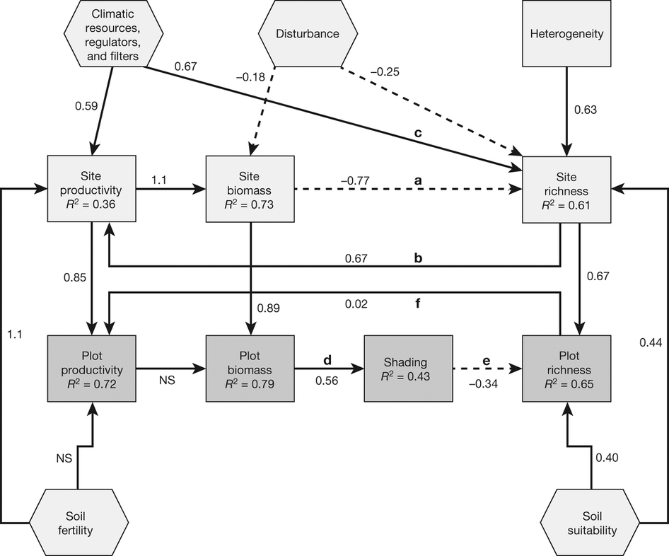
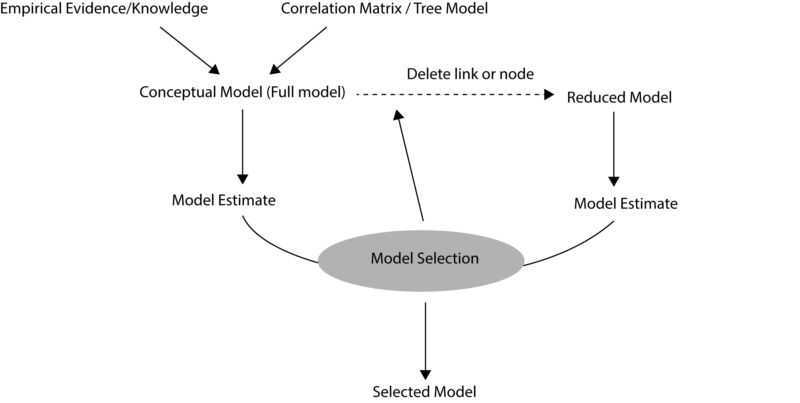

```{r setup, include=FALSE}
knitr::opts_chunk$set(echo = TRUE)
```
###set up the working path and get required R packages
```{r setup files and libraries}
rm(list=ls())    # clear current data in R environment
set.seed(12345) # set seed for the generation of same random number each time you re-run this file
setwd("/Users/qyang/Dropbox/out-projects/SEM_R_group/sem_qy")
#change it to your own path
suppressWarnings(suppressMessages(library(lavaan))) # estimating the SEM
suppressWarnings(suppressMessages(library(semPlot))) # ploting the SEM result
```

## Contents:
1) a short introduction to structural equation modeling (SEM)
2) SEM with lavaan package  
  2.1) define the model  
  2.2) estimate the model  
  2.3) interpret the result  
  2.4) plot the result  
  2.5) model selection  

# ......................

## 1 a short introduction to SEM

Rather than estimating the direct link between the response and one or several predictors, structural Equation Modeling (SEM) or path analysis is a multivariate technique that can test for the nature and magnitude of direct and indirect effects of multiple interacting factors. SEM is an approach that interprets information about the observed correlations among the traits of organisms or groups of organisms in order to evaluate complex causal relationships (Figure 1 shows a typical example of SEM in ecology^[Grace, James B., et al. Integrative modelling reveals mechanisms linking productivity and plant species richness. Nature 529.7586 (2016): 390-393.]). It is a rich technique that is particularly well suited for large-scale observational community or population data sets. Its intuitive connection to how we conceive of our study systems makes it a powerful and useful technique for ecologists and evolutionary biologists.

In general, it has power to

- detect multiple relationships rather than an isolated pair of variables
- estimate indirect effect (effect of A on C through the mediation of B. Trophic cascade for example)
- explore the relationship between latent variables (Path analysis can be considered as a special type of SEM in which there are only observational variables and no latent variable)


```{r, out.width = "650px", echo=FALSE}

```

Figure 1. An example of SEM plot. Structural equation model representing connections between productivity and richness. Solid arrows represent positive effects, dashed arrows represent negative effects. Values beside the arrow are the standardized estimates. 

# ......................

## 2 SEM with lavaan package
A full SEM job will typically consist of the following steps:

- define a full model for a system based on empirical knowledge or primary data mining like correlation matrix, PCA or regression tree. Pairwised scatter plot may be helpful for a rough inspectation toward the relationship between variables, and may also be helpful for detect nonlinear relatiship (exponential response for example) so one can conduct a data transformation before the SEM. The full model will contain all the reasonable relationships within in a system.
- estimate the full model. This will return the estimate of the coefficient and the variance explained by the model for all the variables.
- the full model can be very redundant and model reduction is necessary. The procedure of the model selection can be different depending on whether you want to find the most parsimonious model or find the optimal model for only several target variables. Usually, we focus on several target variables among a lot. Under the premise of enough variance reduction for these object variables, we try to find the relative parsimonious model.
- finally, we can plot and report the estimate of the finally selected model. In most situations, we will report the standardized estimate using which we can compare the relative weight/effect of the relationships.


```{r, out.width = "650px", echo=FALSE}

```
A flow chart of a SEM job

## 2.1 Define SEM model in lavaan

To define a SEM model with lavaan is very similar with other regression you do in R.
We usually write something like Y ~ X1 + X2 + X3 to represent $Y = a + b1 \times X1 + b2 \times X2 +b3 \times X3$ , where Y, X1, X2, X3 are variables and a, b1, b2 and b3 are coefficient we need to estimate.
In SEM, we can write a sentence like above to define how one variable response to other linked variables in the same system. And then enclose all the sentences (each sentence for an individual variable) in a 
' 'sign to indicate the whole model.

the most used syntax of SEM

-  ~ regression 
-  ~1 intercept
-  =~ latent variable
-  ~~ covariance

A complete lavaan model syntax is simply a combination of these formula types, enclosed between the single quote ' '.

```{r, echo=TRUE}
myModel <- '
            # regressions
             y1 + y2 ~ f1 + f2 + x1 + x2
                  f1 ~ f2 + f3
                  f2 ~ f3 + x1 + x2

             # latent variable definitions 
               f1 =~ y1 + y2 + y3 
               f2 =~ y4 + y5 + y6 
               f3 =~ y7 + y8 + y9 + y10

             # variances and covariances 
               y1 ~~ y1 
               y1 ~~ y2 
               f1 ~~ f2
          '  
```
Now we plot it using a function in package 'semPlot' to plot the structure of the SEM to have a intuitive impression.
```{r, echo=TRUE}
 semPaths(myModel) 
```


Another more realistic example is shown below. In this case, the biomass of the phytoplankton is regulate by the nitrogen and phosphrus in a lake. The latent variable eutrophication is determined by the nitrogen and phosphorus, while another latent variable food web is quantified by phytoplankton and zooplankton. Food web can be partly determined by eutrophication state. Phytoplankton and zooplankton can affect each other. 
```{r, echo=TRUE}
# Phy: phytoplankton; Zoo: zooplankton; N: nitrogen; P: phosphorus; ETP: eutrophication; FW: food web; 
 Syntax.example<-'Phy ~ N + P 
 ETP =~ N + P  
 FW =~ Phy + Zoo
 FW ~ ETP
 Phy ~~ Zoo'    
 semPaths(Syntax.example,layout='circle2') 
```
              
More on syntax if you want to dig deeper for the latent variable:

- you can consider the latent variable as the regression line or PC1 cross a bunch of points in a multidimensional state space. By default, this line is a best fitting line for the assigned observed variables. but you can change the line by conducting the following steps
-fix the weight of different observed varibale for the latent regression: you can adjust the importance of the different obserbvational varibales in determing the latent variables. for example, the effect of phosphorus may be more obvious than nitrogen in determing eutrophication level, so we can give a higher weight for phosphorus.
- fixed slope and intercept for the latent variable. for example, you may want the latent regression go across the c(0,0,0....) point of the state space.

## 2.2 estimate the model

The estimate of the model is very simple, and the mostly used function to estimate the model defined as above in section 2.1 is sem(your.defined.model).
Here is an example using the data embedded in the lavvan pacakge. This is just give you a image how the result looks like, and we will got to interpret the result in the following sections.

```{r, echo=TRUE}
## define the model
model <- '
# measurement model
ind60 =~ x1 + x2 + x3
dem60 =~ y1 + y2 + y3 + y4
dem65 =~ y5 + y6 + y7 + y8
# regressions
dem60 ~ ind60
dem65 ~ ind60 + dem60
# residual correlations
y1 ~~ y5
y2 ~~ y4 + y6
y3 ~~ y7
y4 ~~ y8
y6 ~~ y8
'
##estimate the model
fit <- sem(model, data=PoliticalDemocracy)
##return the estimate of the model
summary(fit)
```


## 2.3 interpret the result

The function summary() returns the basic results of the sem modeling. In the summary(fit) function, we omitted the fit.measures=TRUE argument and standardized=TRUE argument. Therefore, you only get the basic chi-square test statistic and the basic estimates. The argument fit.measures=TRUE can return many other evaluation of the model performance. And the argument standardized=TRUE returns the output with standardized parameter values. Two extra columns of standardized parameter values are printed. In the first column (labeled Std.lv), only the latent variables are standardized. In the second column (labeled Std.all), both latent and observed variables are standardized. The latter is often called the ‘completely standardized solution’. Undermost simulations, we will report the Std.all as it gives a direct comparision of the effect size despite the scale discrepancy of different variables. This is also the value where you can find in the most of the sem plot from publications.

We can have a direct comparision of the following result with or without the two terms.
```{r, echo=TRUE}
#I donnot show the result here for saving space, but you can delete # to have a direct feeling of using the arguments
#summary(fit)
#summary(fit, fit.measures=TRUE)
#summary(fit, standardized=TRUE)
#summary(fit, fit.measures=TRUE, standardized=TRUE)
```

## 2.4 plot the model 

As shown in the previous sections, the easiest way we can plot the model is using the function semPaths() from the package semPlot. We plot the last model as an example.
```{r, echo=TRUE}
# Standardized parameters:

semPaths(fit, "std", edge.label.cex = 1,edge.width=.3)

```


## 2.5 model selection 

In the previous sections, we have arbitrarily defined a model. But this model may be over-fitting (too much links for the system or too many varaibles for a variable of interest). 
There are many criterias for determing whether if a model fitting is good or bad. Here I just show a very simple way to do a model comparision^[Hooper, D., Coughlan, J., & Mullen, M. (2008). Structural equation modelling: Guidelines for determining model fit. Articles, 2] using James et al's example^[Grace, J. B., Adler, P. B., Stanley Harpole, W., Borer, E. T., & Seabloom, E. W. (2014). Causal networks clarify productivity–richness interrelations, bivariate plots do not. Functional Ecology, 28(4), 787-798.].

In James et al (2014), the author provid a correlation matrix of three variables as shown in table 1, and we can use this correlation matrix to compare the full model and two alternative models model1 vs model2.

```{r, echo=TRUE}
x<-matrix(c(1,-.35,.45,-.35,1,-.44,.45,-.44,1.00),3,3);
colnames(x)<-c('age','cover','firesev');rownames(x)<-colnames(x)
knitr::kable(x, digits = 2, caption = 'Table 1: Observed correlations among observed variables')
```

we define the full model and two alternative models here and plot the structure:
```{r, echo=TRUE}
model0 <- 'firesev ~ age
           cover ~ firesev + age'
model1 <-  'firesev ~ age
           cover ~ firesev'
model2 <- 'cover ~ age + firesev
           age ~~ 0*firesev' #note I assigned a zero here to exclude the covariance estimation

semPaths(model0,nodeLabels=colnames(x),sizeMan = 10, sizeLat = 10,edge.width=0.5)
semPaths(model1,nodeLabels=colnames(x),sizeMan = 10, sizeLat = 10,edge.width=0.5)
semPaths(model2,nodeLabels=colnames(x),sizeMan = 10, sizeLat = 10,edge.width=0.5)
```

Then, we can estimate the result of these two model.
```{r, echo=TRUE}
fit0 <- sem(model0, sample.cov = x, sample.nobs = 90)
fit1 <- sem(model1, sample.cov = x, sample.nobs = 90)
fit2 <- sem(model2, sample.cov = x, sample.nobs = 90)
summary(fit0, standardized=TRUE)
summary(fit1, standardized=TRUE)
summary(fit2, standardized=TRUE)
```

In the result section, the Chi-Square value is the traditional measure for evaluating overall model fit and, ‘assesses the magnitude of discrepancy between the sample and fitted covariances matrices’ . A good model fit would provide an insignificant result at a 0.05 threshold, thus the Chi-Square statistic is often referred to as either a ‘badness of fit’ or a ‘lack of fit’. In this specieal case with very few variables, our initial model is a full model, so the freedom of the fitting is zero and we lose the P value for the Chi - square. We further compare model1 and model2, we can find only model1 has a P value larger than 0.05. This result show that model1 may be better than model2. We can further compare them using the basic anova() function.

```{r, echo=TRUE}
anova(fit1,fit2)
```
The P value of anova tell us model1 and model2 are significantly different, and Both the AIC and BIC of model1 are smaller than those of model2 which further proved the superiority of model1. 

We further compare model1 with the initial model model0.
```{r, echo=TRUE}
anova(fit0,fit1)
```
Now all the AIC, BIC and P value showed there are no difference between the full model and model1. But as model 1 is more simple than the full model, we will finally select model1.

Now, we can plot the final result here.
```{r, echo=TRUE}
semPaths(fit1,  what = "std", layout = "tree",  style = "lisrel", 
     nodeLabels = c('age','cover','firesev'),
     sizeMan = 10, sizeLat = 10,edge.label.cex = 1,edge.width=0.5,
     intercepts = FALSE)
```


##       reference
